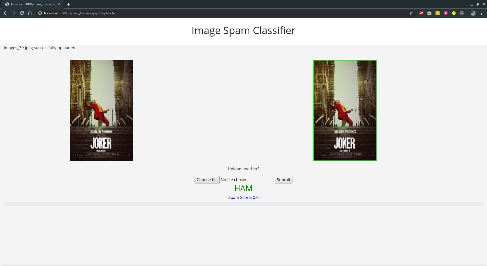
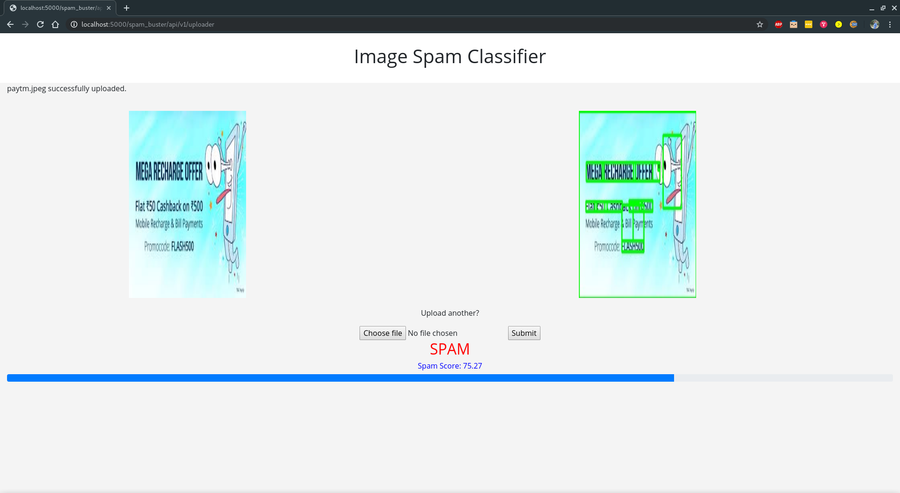

# Problem Statement Description

Build a "Spam Buster" for user generated IMAGE content based on predefined text, links
identified as "known bads", based on which the image should be classified as spam or
not-spam. The "known bads" can be updated anytime.
The "Spam Buster" would need to analyze at image level, identify text components inside image
and build appropriate logic to give a score to the image.
A similar use case is employed by Facebook Ads technology to identify if the image ad contains
too much text or contains any objectionable text."


---

# Solution

We build a flask based micro-service which gives a "Spaminess score" for any uploaded image. The score is derived by aggregating the scores from two models: 
1. Text based spam classifier - Text is extracted from the image and a pre-trained model runs on the text to classify text in respective bucket
2. Image based spam classifier - Convolution neural network which classifies image as spam or not based on the image features

---
## Screenshots





---
## Instructions

#### Work with the spam classifier models

[Image to Text](Image%20to%20Text.ipynb)

[Image Spam Classifier](Image%20Spam%20Classifier.ipynb)

[Text Spam Classifier](Text%20Spam%20Classifier.ipynb)

#### Run locally

Clone the repo and cd into predict folder

```
cd predict

pip install -r requirements.txt

python3 app.py

```

#### Run within docker

Clone the repo and cd into predict folder

Run the image and bash into it to start the server

```
docker run --rm -itd --name hack -v /home/mayur/hack/spam_buster/predict:/predict -p 5000:5000 kayush206/img_spam:v2 bash

docker exec -it hack bash

cd /predict

python3 app.py
```


Access the service- 
http://localhost:5000/spam_buster/api/v1/model

---

Members

* [Mayur Madnani](https://github.com/mayurmadnani)
* [Ayush Kumar](https://github.com/AK-ayush)
* [Shweta Pandey]
